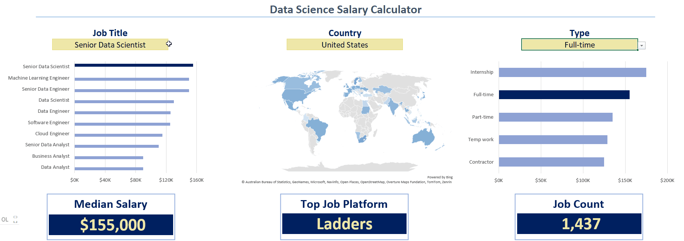
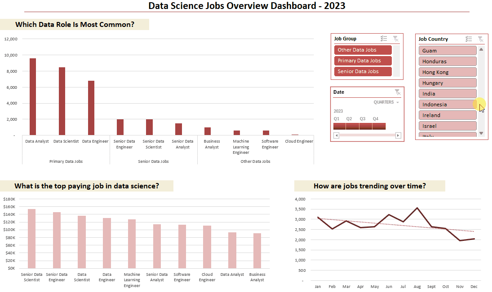

# Excel Data Science Jobs Overview & Salary Analysis Project

This project provides a comprehensive Excel-based analysis of data-related jobs, focusing on salary trends, job roles, and skill-based insights.  
It was built to develop and demonstrate advanced Excel analytics capabilities including Power Query, PivotTables, DAX, and data modeling - while uncovering meaningful insights from real-world job market data.

### Dataset

The dataset used for this project contains real-world data science job information from 2023.
It includes detailed information on:

- **💼 Job Titles**  
- **💰 Salaries (Yearly & Hourly)**  
- **🌍 Locations (US vs Non-US)**  
- **🧰 Technical Skills**

---

## 1️⃣ Dashboard: Country-Based Salary Analysis



This dashboard provides a comprehensive analysis of 2023 data science job salaries across countries, job titles, and employment types. It helps visualize salary trends, compare job types, and identify geographic salary disparities using interactive Excel charts and formulas.

## Excel Skills Used

- **📉 Charts**
- **🧮 Formulas and Functions**
- **🔒 Data Validation**

## Dashboard Build

### 📉 Charts

#### 📊 Data Science Job Salaries - Bar Chart
  

- **Excel Features:** Utilized bar chart feature (with formatted salary values) and optimized layout for clarity.
- **Data Organization:** Sorted job titles by descending salary for improved readability.
- **Insights Gained:** This enables quick identification of salary trends, noting that Senior roles and Engineers are higher-paying than Analyst roles.

#### 🗺️ Country Median Salaries - Map Chart
  

- **Excel Features:** Utilized Excel's map chart feature to plot median salaries globally.
- **Data Representation:** Plotted median salary for each country with available data.
- **Visual Enhancement:** Improved readability and immediate understanding of geographic salary trends.
- **Insights Gained:** Enables quick grasp of global salary disparities and highlights high/low salary regions.

#### 💼 Job Type - Bar Chart
  

- **Excel:** Bar chart showing salary by job type (Full-time, Part-time, Internship, etc.).  
- **Data:** Job types sorted by descending salary for clarity.  
- **Insight:** Highlights which job types offer higher pay, enabling quick salary comparison across employment types.

### 🧮 Formulas and Functions

#### 💰 Median Salary by Job Titles

```
=MEDIAN(
    IF(
        (jobs[job_title_short]=A3)*
        (jobs[salary_year_avg]<>0)*
        (jobs[job_country]=country)*
        (ISNUMBER(SEARCH(type,jobs[job_schedule_type]))),
        jobs[salary_year_avg]
    )
)

```

- **🔢 Formula Purpose:** This formula populates the table, returning the median salary based on job title, country, and type specified.
- **Multi-Criteria Filtering:** Checks job title, country, schedule type, and excludes blank salaries.
- **Array Formula:** Utilizes `MEDIAN()` function with nested `IF()` statement to analyze an array.
  

#### ⏰ Count of Job Schedule Type

```
=FILTER(M2#,NOT(ISNUMBER(SEARCH("and",M2#)))*(M2#<>0))
```
- **🔢 Formula Purpose:** This formula populates the table, which gives a list of unique job schedule types.
- **Unique List Generation:** This Excel formula employs the `FILTER()` function to exclude entries containing "and" or commas, and omit zero values.
  

### 🔒 Data Validation

#### 🔍 Filtered List

- Implementing the filtered list as a data validation rule under the `Job Title`, `Country`, and `Type` options ensures:
    - User input is restricted to predefined, validated schedule types
    - Incorrect or inconsistent entries are prevented
    - Overall usability of the dashboard is improved
---

## 2️⃣ Deep Analysis Sheet


This Excel project combines data cleaning, modeling, and visualization to reveal salary trends across job roles and regions in the data industry.  
Through structured analysis and dynamic dashboards, it demonstrates how Excel can be used not only as a reporting tool but also as a **powerful analytical platform**.  
To understand the data science job market, I asked the following:

1. **Do more skills get you better pay?**
2. **What’s the salary for data jobs in different regions?**
3. **What are the top skills of data professionals?**
4. **What’s the pay for the top 10 skills?**

## Excel Skills Used

- **📊 Pivot Tables**
- **📈 Pivot Charts**
- **🧮 DAX (Data Analysis Expressions)**
- **🔍 Power Query**
- **💪 Power Pivot**


### 1️⃣ Do More Skills Lead to Higher Pay?

**🔍 Skill: Power Query (ETL)**


- **📥 Extract:** Used Power Query to extract data from `data_salary_all.xlsx`, creating two queries: all job information and skills per job ID.


- **🔄 Transform:** Cleaned and prepared each query by adjusting column types, removing unnecessary columns, cleaning text, and trimming whitespace.


- **🔗 Load:** Loaded both cleaned queries into the workbook, forming the base for analysis.


- **💡 Insights:**
- More skills in job postings correlate with higher median salaries, especially for roles like Senior Data Engineer and Data Scientist.
- Roles requiring fewer skills, like Business Analyst, tend to offer lower salaries.
- Highlights the value of acquiring multiple relevant skills for higher-paying roles.
  


### 2️⃣ What’s the salary for data jobs in different regions?

**🧮 Skills: PivotTables & DAX**

- **📈 Pivot Table:** Created a PivotTable using the Power Pivot Data Model, placing `job_title_short` in rows and `salary_year_avg` in values. Added a measure for median US salary:
```DAX
=CALCULATE(
    MEDIAN(data_jobs_all[salary_year_avg]),
    data_jobs_all[job_country] = "United States")
```

- **🧮 DAX:** Calculated median year salary:
```DAX
Median Salary := MEDIAN(data_jobs_all[salary_year_avg])
```

- **💡 Insights:**
  - Senior Data Engineer and Data Scientist roles have higher median salaries globally.
  - Salary disparity between US and Non-US roles is notable, influenced by tech industry concentration.


### 3️⃣ What are the top skills of data professionals?

**🔧 Skill: Power Pivot**

- **💪 Power Pivot:** Integrated `data_jobs_all` and `data_jobs_skills` into a single data model. Data was pre-cleaned using Power Query.
- **🔗 Data Model:** Created a relationship between tables via `job_id`.
- **📃 Power Pivot Menu:** Used to refine the data model and simplify measure creation.

- **💡 Insights:**
  - SQL and Python are the top skills in data jobs.
  - Cloud technologies like AWS and Azure are increasingly important.


### 4️⃣ What’s the pay for the top 10 skills?

**📊 Skill: Advanced Charts (Pivot Chart)**

- **📈 PivotChart:** Created a combo PivotChart to show median salary and skill likelihood (%):
  - **Primary Axis:** Median Salary (Clustered Column)
  - **Secondary Axis:** Skill Likelihood (Line with Markers)
- Customized chart: added axis titles, removed skill likelihood lines, changed markers to diamonds.

- **💡 Insights:**
  - Higher salaries linked to skills like Python, Oracle, and SQL.
  - Skills like PowerPoint and Word have lower median salaries and likelihood, showing less demand in high-paying roles.


---


## 3️⃣ Dashboard: Data Science Jobs Overview



This project is an **interactive Excel dashboard** providing a comprehensive overview of the data science job market in 2023. It leverages pivot tables, advanced Excel calculations, and dynamic slicers to analyze job distribution, salary trends, and monthly hiring patterns.

The dashboard was designed to:
- Provide a **clear overview** of the data science job market.  
- Highlight **high-demand roles** and **salary benchmarks**.  
- Analyze **temporal trends** in job openings for informed decision-making.

## Excel Skills Used

- **📊 Pivot Tables**
- **📈 Pivot Charts**
- **🔘 Slicers & Trendlines**

## Dashboard Build

### 📉 Charts

1. **Which Data Role Is Most Common?**  
   - Column chart showing distribution of job roles, grouped into primary, senior, and other data jobs.

2. **What is the Top Paying Job in Data Science?**  
   - Column chart ranking job roles by average yearly salary.

3. **How Are Jobs Trending Over Time?**  
   - Line chart showing job postings by month, including a trendline for visualizing overall growth.

### 🔄 Interactive Slicers

The dashboard includes slicers to filter data by:
- **Country**  
- **Job Group** (Primary, Senior, Other)  
- **Quarter** (for date-based trends)  

This allows users to dynamically analyze job count, salary, and trends across different dimensions.

## 🛡️ License
This project is licensed under the [MIT License](LICENSE). You are free to use, modify, and share this project with proper attribution.

---

## 🌟 About Me
👋 Hi! I'm **Omer Doron**  
I’m a student of Information Systems specializing in **Digital Innovation**.  
I’m passionate about transforming raw information into meaningful insights.  

I created this project as part of my learning journey in **data warehousing and analytics**, and as a showcase of my **technical and analytical skills**.

🔗 [Connect with me on LinkedIn](https://www.linkedin.com/in/omer-doron-a070732b1/)

