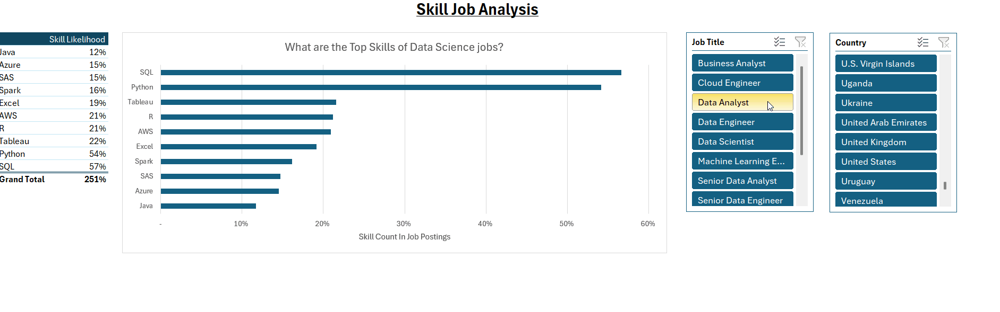

## Deep Analysis Sheet




This Excel project combines data cleaning, modeling, and visualization to reveal salary trends across job roles and regions in the data industry.  
Through structured analysis and dynamic dashboards, it demonstrates how Excel can be used not only as a reporting tool but also as a **powerful analytical platform**.  
To understand the data science job market, I asked the following:

1. **Do more skills get you better pay?**
2. **What’s the salary for data jobs in different regions?**
3. **What are the top skills of data professionals?**
4. **What’s the pay for the top 10 skills?**

## Excel Skills Used

- **📊 Pivot Tables**
- **📈 Pivot Charts**
- **🧮 DAX (Data Analysis Expressions)**
- **🔍 Power Query**
- **💪 Power Pivot**


### 1️⃣ Do More Skills Lead to Higher Pay?

**🔍 Skill: Power Query (ETL)**


- **📥 Extract:** Used Power Query to extract data from `data_salary_all.xlsx`, creating two queries: all job information and skills per job ID.


- **🔄 Transform:** Cleaned and prepared each query by adjusting column types, removing unnecessary columns, cleaning text, and trimming whitespace.


- **🔗 Load:** Loaded both cleaned queries into the workbook, forming the base for analysis.


- **💡 Insights:**
- More skills in job postings correlate with higher median salaries, especially for roles like Senior Data Engineer and Data Scientist.
- Roles requiring fewer skills, like Business Analyst, tend to offer lower salaries.
- Highlights the value of acquiring multiple relevant skills for higher-paying roles.
  


### 2️⃣ What’s the salary for data jobs in different regions?

**🧮 Skills: PivotTables & DAX**

- **📈 Pivot Table:** Created a PivotTable using the Power Pivot Data Model, placing `job_title_short` in rows and `salary_year_avg` in values. Added a measure for median US salary:
```DAX
=CALCULATE(
    MEDIAN(data_jobs_all[salary_year_avg]),
    data_jobs_all[job_country] = "United States")
```

- **🧮 DAX:** Calculated median year salary:
```DAX
Median Salary := MEDIAN(data_jobs_all[salary_year_avg])
```

- **💡 Insights:**
  - Senior Data Engineer and Data Scientist roles have higher median salaries globally.
  - Salary disparity between US and Non-US roles is notable, influenced by tech industry concentration.


### 3️⃣ What are the top skills of data professionals?

**🔧 Skill: Power Pivot**

- **💪 Power Pivot:** Integrated `data_jobs_all` and `data_jobs_skills` into a single data model. Data was pre-cleaned using Power Query.
- **🔗 Data Model:** Created a relationship between tables via `job_id`.
- **📃 Power Pivot Menu:** Used to refine the data model and simplify measure creation.

- **💡 Insights:**
  - SQL and Python are the top skills in data jobs.
  - Cloud technologies like AWS and Azure are increasingly important.


### 4️⃣ What’s the pay for the top 10 skills?

**📊 Skill: Advanced Charts (Pivot Chart)**

- **📈 PivotChart:** Created a combo PivotChart to show median salary and skill likelihood (%):
  - **Primary Axis:** Median Salary (Clustered Column)
  - **Secondary Axis:** Skill Likelihood (Line with Markers)
- Customized chart: added axis titles, removed skill likelihood lines, changed markers to diamonds.

- **💡 Insights:**
  - Higher salaries linked to skills like Python, Oracle, and SQL.
  - Skills like PowerPoint and Word have lower median salaries and likelihood, showing less demand in high-paying roles.


